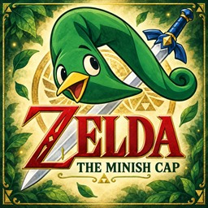

# Minish Cap — Switch Community Edition

> **Test candidate 0.1.2-rc.3:** fixes a clock overflow that blocks frame pacing
> and preserves sprite scale/rotation when returning from the pause menu.
> Host regressions passed; both fixes still need confirmation on Switch.
> See [stability notes](docs/STABILITY.md).

> **Test candidate 0.1.2-rc.3:** fixes packed GBA pointers used by cat attacks,
> removes continuous dialog writes to SD, and adds crash/stall reports.
> The Dr. Left book quest and reports still need on-console validation.
> The freeze near the Minish remains unconfirmed; see [stability notes](docs/STABILITY.md).

[Português](README.md)

A Nintendo Switch native port maintained through fixes found during regular
play. This edition starts with fixes for Hyrule door positions and the broken
floor interaction that created black tiles and a sword beside doors. The
maintainer confirmed those gameplay fixes on Switch on September 15, 2026.

The library Minish script flag is now restored from the USA ROM. NPC sprite
bounds and script-context guards address crash paths documented by the reference
edition for Lake Hylia. The maintainer confirmed both fixes on Switch on
September 16, 2026. Version 0.1.1 embeds the new Ezlo icon in the NRO. See [NPC investigation](docs/NPC_FIXES.md).

## Play

1. Use a Switch already set up to run homebrew.
2. Download the [v0.1.1 package](https://github.com/fantonioluz/tmc-switch-community/releases/download/v0.1.1/tmc-switch-community-0.1.1-usa.zip), or copy `release/switch/` to your SD.
3. Dump your own original **USA** cartridge and place the dump at
   `SD:/switch/tmc/baserom.gba` beside `tmc.nro`.
4. Open Homebrew Menu in application mode (hold **R** while launching an installed
   title), then launch the port.
5. Keep the included `assets/` folder beside the NRO. If the game regenerates the cache, let it finish.

The package includes the NRO and 21 runtime asset files supplied by the maintainer.
No ROM is included; each player supplies their own cartridge dump. The USA reference
header is `BZME`, with SHA-1 `b4bd50e4131b027c334547b4524e2dbbd4227130`.
Other regions and patched ROMs are not validated. Documentation language does
not change the game's dialogue language.

Back up `SD:/switch/tmc/` before updating. Copy the package's NRO and `assets/`
folder, preserving your ROM, `tmc.sav`, and configuration. A clean installation
of this exact package still needs real-hardware confirmation. The earlier door
and floor fixes were confirmed using the maintainer's existing installation.

## Development

The working source snapshot is in [`source/`](source/), including the local
dependency sources. See [development](docs/DEVELOPMENT.md),
[release preparation](docs/RELEASING.md), [credits](CREDITS.md),
[licenses](LICENSE.md), and [known issues](docs/KNOWN_ISSUES.md).

The repository layout and NPC/first-install crash investigation were informed by
[Alek's Ultimate NX Edition](https://github.com/Alexgg1014/The-Legend-of-Zelda-The-Minish-Cap-Alek-s-Ultimate-NX-Edition).
Its exclusive features are not claimed by this separate edition.

This is an unofficial fan project, unaffiliated with Nintendo or Capcom.

## Community menu and updates

On Switch, press **Minus (-)** during gameplay to open the Community menu. It includes Image, Audio, Controls, Saves/Backups, Diagnostics, Achievements, Updates and Help. Manual backups are timestamped as 	mc.sav.bak-AAAAMMDD-HHMMSSmc.sav.bak-YYYYMMDD-HHMMSS.

